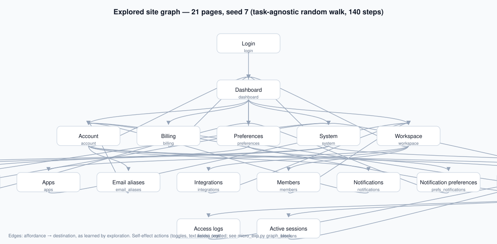
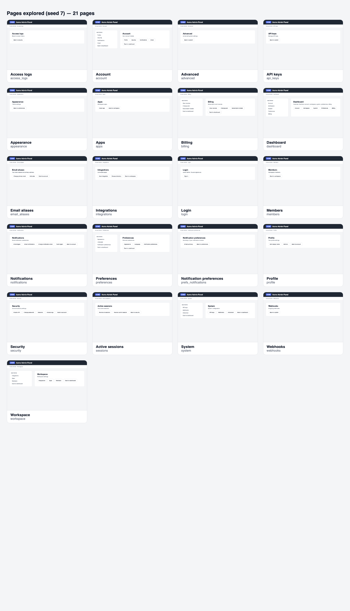

# computer-use-graph

Public, clean-room research project on web agents.

**Question:** does an autonomously explored, type-abstracted site graph beat token-matched flat
trajectory memory at equal amortized cost, on configuration-heavy sites? And can an uncertainty
signal calibrated against episode outcome decide when to trust it?

**Status (2026-09-12):** literature review and verification pass complete; design v0.2 written;
micro-validation run done (see below). No experiments on a real benchmark have run yet.

## What we've measured so far

A [micro-validation run](micro/README.md) on a synthetic config-admin site (25 pages, decoy
labels, 3-level nav) tested the harness mechanics before any real benchmark work: three memory
arms — none, flat transcript, site graph — built from the **same task-agnostic exploration**,
char-matched budgets, 24 tasks × 3 exploration seeds (216 paired episodes).

| arm | success | 95% CI | avg steps |
|---|---|---|---|
| none | 59.7% | [48.2%, 70.3%] | 7.3 |
| flat | 70.8% | [59.5%, 80.1%] | 6.5 |
| graph | 73.6% | [62.4%, 82.4%] | 6.4 |

What it showed (details and caveats in `micro/README.md`):

- **The mechanism works end-to-end:** task-agnostic crawl → same-data graph/flat memories →
  controlled contrast → programmatic validators → paired McNemar + AUROC analysis.
- **Flat memory takes most of the win** (+11.1pp of the +14.0pp total) — reproducing in miniature
  the finding that drove the design: the primary contrast is graph vs flat, and it will be small.
- **The primary contrast is not yet distinguishable from noise** (+2.8pp, p=0.73 at n=72) — the
  power math from the methodology notes is confirmed empirically; the real experiment needs the
  full 362-task benchmark.
- **Verbalized confidence is uninformative** (AUROC 0.46–0.51 at every progress quartile) —
  consistent with the *Last Step Matters* finding; the action-entropy scorer is the next signal
  to instrument.

This is a smoke test of the machinery, not evidence for the hypothesis. The pre-registered
experiment sequence is in `docs/02-design-v0.2.md` §8.

## Start here

1. [Key findings](knowledge/08-key-findings.md) — what we learned that changed the plan
2. [Action-space ladder](knowledge/02-action-space-ladder.md) — the computer-use substrate question
3. [Design v0.2](docs/02-design-v0.2.md) — the current design and experiment sequence
4. [Decisions log](knowledge/09-decisions-log.md) — what's decided, proposed, and open
5. [Micro-validation run](micro/README.md) — the experiment and its results
6. [Replication lineage](#replication-lineage) — how the micro run maps to
   [Environment Maps (arXiv:2603.23610)](https://arxiv.org/abs/2603.23610), the closest prior work
7. [Demo pointers](#demo-pointers-current-state-10-minutes) — the 10-minute walkthrough of the
   current state

## Layout

```
README.md, CLAUDE.md (AGENTS.md → CLAUDE.md)   orientation for people and agents
docs/
  01-foundations.md        v0.1, frozen — taxonomy and action-space ladder as first written
  02-design-v0.2.md        current design
knowledge/                 maintained, topic-organized notes (index: 00-index.md)
  01 taxonomy · 02 action space · 03 benchmarks · 04 state & graphs · 05 memory & replay
  06 uncertainty · 07 methodology · 08 key findings · 09 decisions · 10 open questions · 11 glossary
micro/                     minimal validation experiment (synthetic site, results, analysis)
research/                  frozen evidence
  README.md                how it was produced; incidents affecting trust
  00-verification-log.md   root spot-checks and corrections
  00-worker-briefs.md      exact research prompts
  R0–R5                    one dossier per thread
bibliography/
  references.md            every cited source with verification status (generated)
  build_references.py      regenerates references.md from the dossiers
```

## Reproduce the micro run

Requires `oll` (Ollama Cloud CLI) on PATH. One arm, one exploration seed:

```bash
python3 micro/micro_exp.py --arm graph --seed 7 --out micro/results_graph_s7.json
```

Arms are `none`, `flat`, `graph`; seeds used in the run were 7, 11, 23. Aggregate and analyze:

```bash
python3 micro/analyze.py
```

Stdlib only, no other dependencies. Each full arm-seed run is ~24 episodes × ~7 LLM calls.

## The site and what was explored

The micro experiment runs on a synthetic admin panel — 25 pages, 3-level navigation, decoy
labels. The exploration (task-agnostic random walk, seed 7) visited 21 of them:



Pages as the agent sees them (all 21 explored pages, seed 7):



Individual pages: [dashboard](micro/img/pages/dashboard.png) ·
[account](micro/img/pages/account.png) · [security](micro/img/pages/security.png) ·
[notifications](micro/img/pages/notifications.png) — note the decoy labels ("Email digest" next
to "Email notifications") · [integrations directory](micro/img/pages/integrations_dir.png) —
"Install analytics" next to "Install beta analytics" · [billing](micro/img/pages/billing.png).
Regenerate with `python3 micro/render_pages.py` and `python3 micro/render_graph.py`.

## Replication lineage

The micro experiment is a deliberate miniature of the closest prior work: **Environment Maps:
Structured Environmental Representations for Long-Horizon Agents**
([arXiv:2603.23610](https://arxiv.org/abs/2603.23610), root-verified — see
[verification log](research/00-verification-log.md)). Their setup and ours:

| Element | Environment Maps (paper) | This repo (micro run) |
|---|---|---|
| Environment | WebArena, 812 tasks, 5 sites | Synthetic config-admin site, 24 tasks |
| Arms | no map / raw trajectory access / environment map | [none / flat / graph](micro/micro_exp.py) |
| Map source | 179 human recordings | task-agnostic autonomous exploration (the firewall they lack) |
| Headline | 14.2% → 23.3% → 28.2% | 59.7% → 70.8% → 73.6% |
| Flat share of win | 9.1 of 14.0pp (65%) | 11.1 of 14.0pp (79%) |
| Structure-over-flat | +4.9pp (not compute-matched) | +2.8pp (char-matched, p=0.73) |
| Held-out firewall | not stated (22% trace coverage) | by construction (crawler never sees tasks) |
| Cost accounting | construction reported, not amortized | next: budget sweep (design §8) |

The micro run replicates the paper's **ordering** (none < flat < map) and its **flat-dominance
finding** (F2), on a controlled site where budgets are matched — the two things the paper's setup
could not guarantee. What it does not yet replicate: their per-site breakdown, their multi-site
transfer null (0/48), and amortized cost. Those are Phase 2–3 in
[design v0.2](docs/02-design-v0.2.md).

## Demo pointers (current state, ~10 minutes)

1. **The bet** — this README, top.
   - *The whole project in one sentence: structure beats flat memory only if you count the
     exploration cost. Everything after this is machinery for testing that sentence.*
2. **Why graph-vs-flat** — [key findings](knowledge/08-key-findings.md) F1, F2.
   - *The literature already answered graph-vs-nothing (14.2 → 28.2) and showed flat memory
     takes ~2/3 of any win. So the only question left worth asking is the small one: does
     structure add anything over flat, at matched cost?*
3. **The experiment in code** — [micro_exp.py](micro/micro_exp.py): `PAGES` (decoy labels),
   `explore()` (task-agnostic firewall), `graph_block` vs `flat_block` (same data, char-matched).
   - *Three design choices carry the whole experiment: decoy labels (the site can't be
     brute-forced), a task-agnostic crawler (no eval contamination), and char-matched memories
     (the arms differ in structure, nothing else).*
4. **The two memories** — [graph](micro/memory_graph_s7.txt) vs [flat](micro/memory_flat_s7.txt).
   - *Same exploration log, two formats. The graph is ~40 lines of "page: [button →
     destination]"; the flat is the same facts buried in narrative order. That difference —
     and nothing else — is what the experiment measures.*
5. **Live run** — `python3 micro/micro_exp.py --arm graph --seed 7 --out /tmp/demo.json`
   (fallback: committed [results](micro/results_graph_s7.json)).
   - *Every step is one model call: observe page → choose action → log confidence. No hidden
     state, no clever tooling — the agent is deliberately simple so the memory contrast stays
     clean.*
6. **Results** — `python3 micro/analyze.py` (arm table, paired McNemar, AUROC; numbers in
   [micro/README.md](micro/README.md)).
   - *The ordering matches the hypothesis (59.7 → 70.8 → 73.6) and the honest headline is the
     second table: graph-vs-flat is +2.8pp at p=0.73 — exactly the "small effect, underpowered
     sample" the repo's own power tables predicted. The AUROC block is the bonus finding: the
     agent's self-reported confidence is a coin flip.*
7. **Replication lineage** — the table above; paper: [arXiv:2603.23610](https://arxiv.org/abs/2603.23610).
   - *The miniature reproduces the paper's ordering and its flat-dominance finding — with the
     two controls the paper lacked (matched budgets, held-out firewall). Same science, tighter
     controls, one site smaller.*
8. **Honest close** — [micro/README.md](micro/README.md) limitations; next steps in
   [design v0.2](docs/02-design-v0.2.md) §8.
   - *What's validated is the machinery and the direction; what's not established is the
     hypothesis itself. The next dollar goes to the entropy scorer and the WebArena pilot —
     both pre-registered, neither started.*

## Scope rule

Clean-room and public. No employer-internal technology, data, benchmarks, or unreleased work informs
anything here. Every substantive claim carries a public citation. **✓** marks claims the root session
re-verified; everything else must be re-checked before external citation. Measured claims from our
own runs link to the raw result files that produced them.